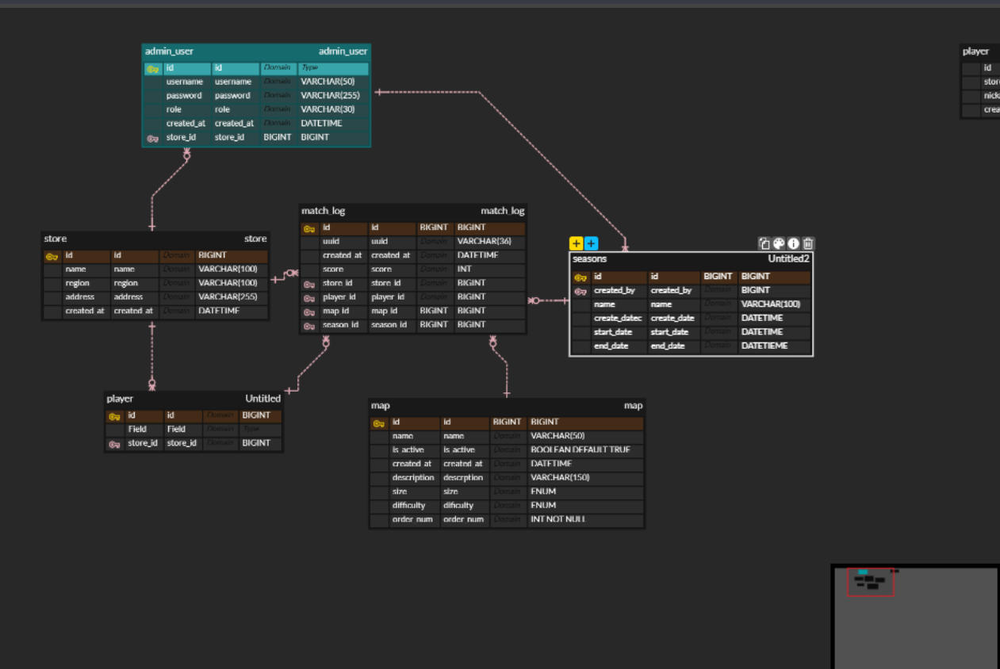

# 1. 프로젝트 개요

본 프로젝트는 **매장 기반 점프 배틀 게임 랭킹 시스템**을 설계하는 것을 목표로 한다.

시스템은 다음을 관리한다:

- 매장(Store)
- 매장 관리자(Admin User)
- 플레이어(Player)
- 맵(Map)
- 매치 기록(Match Log)
- 시즌(Seasons)
- 장치(Device-추가예정)

랭킹은 매치 로그를 기반으로 집계되며,  
**시즌별 / 전체 랭킹 조회가 가능하도록 설계하였다.**

---

# 2. ERD



---

# 3. 엔티티 상세 설명

## 3.1 Admin User (관리자)

매장 관리자 및 통합 관리자를 관리하는 테이블이다.

| 컬럼명 | 타입 | 설명 |
|--------|------|------|
| id | BIGINT (PK) | 관리자 고유 식별자 |
| username | VARCHAR(50) | 로그인 아이디 |
| password | VARCHAR(255) | 비밀번호 |
| role | VARCHAR(30) | 관리자 권한 (STORE_ADMIN / SUPER_ADMIN) |
| created_at | DATETIME | 생성일 |
| store_id | BIGINT (FK) | 소속 매장 |

### 관계

- 하나의 매장은 여러 명의 관리자를 가질 수 있다. (1:N)
- 통합 관리자는 시즌을 생성할 수 있다.

---

## 3.2 Store (매장)

매장 정보를 관리하는 테이블이다.

| 컬럼명 | 타입 | 설명 |
|--------|------|------|
| id | BIGINT (PK) | 매장 고유 식별자 |
| name | VARCHAR(100) | 매장명 |
| region | VARCHAR(100) | 지역 |
| address | VARCHAR(255) | 주소 |
| created_at | DATETIME | 생성일 |

### 관계

- 하나의 매장은 여러 플레이어를 가진다. (1:N)
- 하나의 매장은 여러 매치 로그를 가진다. (1:N)

---

## 3.3 Player (플레이어)

플레이어 정보를 저장한다.  
플레이어는 로그인 기능이 없다.

| 컬럼명 | 타입 | 설명 |
|--------|------|------|
| id | BIGINT (PK) | 플레이어 고유 식별자 |
| store_id | BIGINT (FK) | 소속 매장 |
| nickname | VARCHAR(50) | 닉네임 |
| created_at | DATETIME | 생성일 |

### 관계

- 하나의 플레이어는 여러 매치 로그를 가진다. (1:N)

---

## 3.4 Map (맵)

게임에서 사용되는 맵 정보를 관리한다.

| 컬럼명 | 타입 | 설명 |
|--------|------|------|
| id | BIGINT (PK) | 맵 고유 식별자 |
| name | VARCHAR(50) | 맵 이름 |
| description | VARCHAR(150) | 맵 설명 |
| size | ENUM | 맵 크기 (SMALL, MEDIUM, LARGE) |
| difficulty | ENUM | 난이도 (EASY, NORMAL, HARD 등) |
| order_num | INT | 표시 순서 |
| is_active | BOOLEAN | 사용 여부 |
| created_at | DATETIME | 생성일 |

### 설계 의도

- 맵은 독립 엔티티로 설계하였다.
- 매치 로그에서 외래키로 참조한다.
- `order_num`은 UI 정렬을 위한 필드이다.
- `size`와 `difficulty`는 고정 값이므로 ENUM 타입을 사용하였다.

---

## 3.5 Seasons (시즌)

시즌별 랭킹 관리를 위한 테이블이다.

| 컬럼명 | 타입 | 설명 |
|--------|------|------|
| id | BIGINT (PK) | 시즌 고유 식별자 |
| name | VARCHAR(100) | 시즌명 |
| start_date | DATETIME | 시작일 |
| end_date | DATETIME | 종료일 |
| created_at | DATETIME | 생성일 |
| created_by | BIGINT (FK) | 생성 관리자 (admin_user.id) |

### 설계 특징

- 시즌 기간 중복은 허용하지 않는다.
- 시즌이 없는 매치 로그도 존재 가능하다.
- `match_log.season_id`는 NULL 허용으로 설계하였다.
- 시즌 생성은 통합 관리자만 가능하도록 서비스 레이어에서 제어한다.

### 관계

- 하나의 시즌은 여러 매치 로그를 가진다. (1:N)

---

## 3.6 Match Log (매치 기록)

랭킹 집계의 핵심 테이블이다.

| 컬럼명 | 타입 | 설명 |
|--------|------|------|
| id | BIGINT (PK) | 매치 고유 식별자 |
| uuid | VARCHAR(36) | 외부 식별 UUID |
| created_at | DATETIME | 플레이 시간 |
| score | INT | 점수 |
| store_id | BIGINT (FK) | 매장 |
| player_id | BIGINT (FK) | 플레이어 |
| map_id | BIGINT (FK) | 맵 |
| season_id | BIGINT (FK, NULL) | 시즌 |

### 설계 의도

- 모든 랭킹은 `match_log`를 기준으로 집계한다.
- 시즌별 랭킹 조회가 가능하다.
- 전체 랭킹은 `season_id` 조건 없이 조회한다.
- `season_id`는 NULL을 허용하여 시즌이 없는 기록도 저장 가능하도록 설계하였다.

---

# 4. 관계 요약

```
admin_user (1) ────< store
admin_user (1) ────< seasons
store (1) ────< player
store (1) ────< match_log
player (1) ────< match_log
map (1) ────< match_log
seasons (1) ────< match_log
```

---

# 5. 설계 특징 요약

- 모든 PK는 BIGINT를 사용하였다.
- 모든 FK는 참조 PK와 동일한 타입으로 통일하였다.
- 시즌은 선택적(Nullable) 관계로 설계하였다.
- 비식별 관계를 사용하여 유연성을 확보하였다.
- 시즌 기간 중복은 서비스 로직에서 검증하도록 설계하였다.
- ENUM은 맵의 고정 속성(size, difficulty)에만 사용하였다.였다